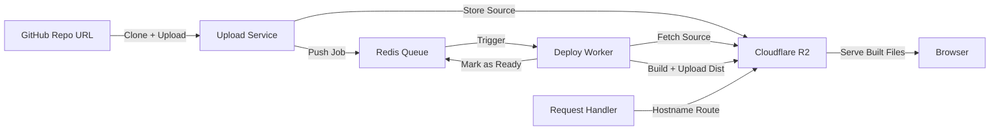

# Vercel Clone  

As a long-time user of Vercel and other deployment platforms, I’ve always been curious about what happens behind the scenes. From the outside, it feels like magic — connect your GitHub repo, wait a bit, and suddenly your site is live.  

That curiosity led me to dig into how Vercel works. I came across [this post from Vercel](https://vercel.com/blog/behind-the-scenes-of-vercels-infrastructure), which explained their system in terms of three phases:  

1. **Upload** – getting source code into storage  
2. **Deploy** – building the code into production-ready artifacts  
3. **Request Handling** – serving the built app to users  

I decided to try building my own simplified version of vercel. The goal wasn’t to make a production-ready hosting service, but to explore how modern deployment platforms work.

---

## Technologies Chosen  

I wanted to pick tools that mirrored what real-world deployment pipelines use while still being approachable for a solo project:  

- **Node.js & TypeScript** – for building reliable backend services with type safety.  
- **Express** – to keep the server layer lightweight and flexible.  
- **Redis** – as a message queue and state manager between services (upload → deploy → serve).  
- **Cloudflare R2** – as object storage for uploaded repos and built files (a simpler alternative to S3).  
- **React** – for the frontend, to give me a clean developer dashboard and deployment UI.  

Each choice served a purpose: Redis allowed smooth communication between phases, R2 provided durable storage, and TypeScript/Express made building services more structured.  

---

## System Flow  

Here’s a visual of how everything connects:  

This diagram shows the three main phases — upload, deploy, request handling — and how Redis + R2 tie them together.

---

## Phase 1: Upload  

The first step was handling the intake of source code.  

- The service takes in a GitHub repo URL.  
- Using **simple-git**, it clones the repo locally.  
- Files are uploaded into **Cloudflare R2** under a unique deployment ID.  
- Once uploaded, the deployment ID is pushed into a Redis queue (`build-queue`) and marked as ready.  

This gave me a clear entry point for every deployment — a raw set of files stored in one place, waiting to be processed.  

---

## Phase 2: Deploy  

Once the files were uploaded, the deploy service began.  

- A background worker listens to Redis for new jobs.  
- When triggered, it fetches the repo files from R2.  
- It runs a **build step** (via a `buildProject` utility), outputting a `dist/` folder.  
- The built files are uploaded back to R2.  
- Redis is updated to mark the deployment as “deployed.”  

Since the upload service didn’t need to know anything about the deploy service, Redis handled the communication. This meant multiple workers could run in parallel and process several deployments at once, just like Vercel does at scale.  

---

## Phase 3: Request Handling  

The final piece was making deployments accessible.  

- Incoming requests were routed based on the hostname (`{id}.mydomain.com`).  
- The handler mapped the path to the correct file in R2 (`dist/{id}/...`).  
- It set the right MIME type (`html`, `css`, `js`, etc.) and streamed the file back.  

This was the most rewarding part because it tied everything together. Suddenly, each deployment had its own subdomain, and I could actually open a browser and see it working.  

---

## Challenges Faced

This project came with its fair share of challenges:  

- Understanding Redis queues and conditions.
- Learning how to set up Cloudflare R2 storage services.
- Writing contained tests for each step.
- Debugging routes with Postman for each phase.
- Ensuring Express routed requests correctly so each deployment had its own unique subdomain (based on the deployment ID).
- Connecting the backend to a clean frontend UI.
  
---

## Lessons Learned  

Working on this project taught me a lot about both the tools and the process behind deployment pipelines:  

- **Redis isn’t just a cache** – I learned how powerful it can be for queues and keeping track of what’s happening across services.  
- **Express routing can be tricky** – figuring out subdomains and serving the right files made me think carefully about request flow.  
- **Cloudflare R2s** – I had to be careful to keep deployments separate and avoid overwriting files.  
- **Async flows matter** – coordinating upload → build → serve really highlighted the importance of handling promises correctly.  
- **Test in small steps** – breaking things into smaller, contained tests saved me from hours of debugging later.  
- **Think like a distributed system** – splitting upload, deploy, and request handling into separate services gave me a taste of event-driven architecture.  

Overall, it was a great reminder that breaking big problems into smaller pieces and testing each step makes even complex systems manageable.

---

## Final Thoughts  

What started as simple curiosity ended up being one of the most rewarding learning experiences I’ve had so far.
Breaking things down into upload → deploy → request handling gave me a much better understanding of what’s actually happening behind the scenes of modern deployment platforms. 

Along the way, I got plenty of hands-on time with Redis, Express, Node.js, and Cloudflare R2 — tools I know I’ll reach for again in future projects.

---
